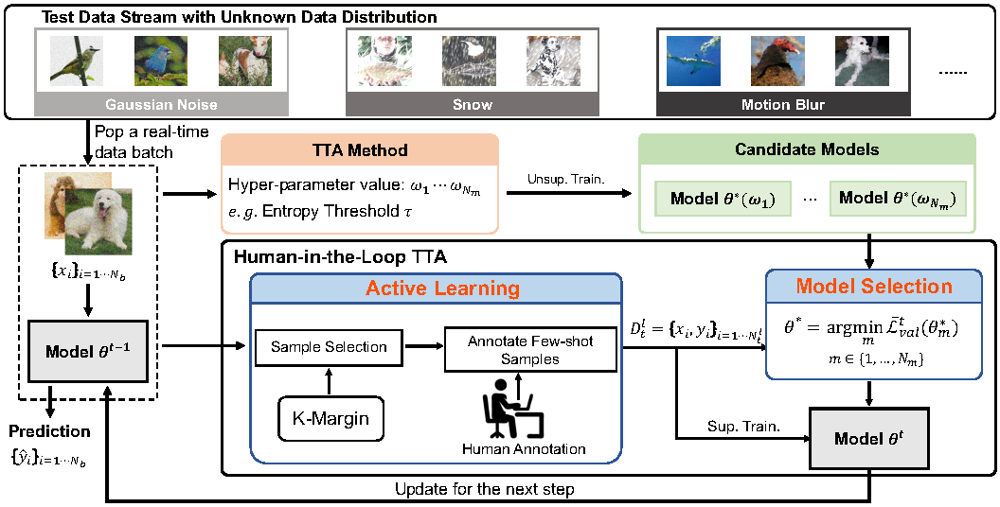

# Exploring Human-in-the-Loop Test-Time Adaptation by Synergizing Active Learning and Model Selection

This repository provides the official PyTorch implementation of our TMLR paper:    


> [<ins>**Exploring Human-in-the-Loop Test-Time Adaptation by Synergizing Active Learning and Model Selection**</ins>]
[](https://arxiv.org/abs/2405.18911)
[](https://openreview.net/forum?id=P09rAv8UH7) <br>
> Authors: *[<ins>**Yushu Li***</ins>](https://yushu-li.github.io/), [<ins>**Yongyi Su***</ins>](https://yysu.site/), [<ins>**Xulei Yang**</ins>](https://dawdleryang.github.io/), [<ins>**Kui Jia**</ins>](http://kuijia.site/), [<ins>**Xun Xu†**</ins>](https://scholar.google.com/citations?user=pi0SGQUAAAAJ)*   


## 🔍 Overview

<p align = "center">

</p>
<p align = "center">
The overall framework of HILTTA.
</p>
Human-in-the-Loop Test-Time Adaptation (HILTTA) is a plug-and-play method that enhances Test-Time Adaptation (TTA) by integrating active learning and model selection. By employing a limited label budget, HILTTA achieves improved robustness to hyperparameter variations and enhanced performance in continually changing scenarios. It incorporates K-Margin for active sample selection and a model selection mechanism.<br><br>
This repository provides the implementation of HILTTA, demonstrating its integration with six state-of-the-art TTA methods across four datasets: CIFAR10-C, CIFAR100-C, ImageNet-C, and ImageNet-D."


## 📐 Prerequisites

### Hardware

This implementation supports single-GPU configurations. We recommend an NVIDIA RTX 3090 with 24GB of memory for optimal performance, as used in our experiments.

### Environment 
The code is tested on Python 3.8. Please install the required packages using the following command:
```
pip install -r requirements.txt
```

### Datasets
    We use the following datasets for evaluation:


  - `cifar10_c` [CIFAR10-C](https://zenodo.org/record/2535967#.ZBiI7NDMKUk)
  - `cifar100_c` [CIFAR100-C](https://zenodo.org/record/3555552#.ZBiJA9DMKUk)
  - `imagenet_c` [ImageNet-C](https://zenodo.org/record/2235448#.Yj2RO_co_mF)
  - `imagenet_d` [ImageNet-D](https://github.com/bethgelab/robustness/tree/main/examples/imagenet_d)


Please refer to the [test-time-adaptation](https://github.com/mariodoebler/test-time-adaptation?tab=readme-ov-file) repository for data preparation details. And download datasets to the `data` folder, listed as below:


```
data/
├── CIFAR-10-C/
├── CIFAR-100-C/
├── ImageNet-C/
├── imagenet2012/
│   └── val/
└── imagenet-d/
```


### Models
  - For adapting to ImageNet variations, all pre-trained models available in [Torchvision](https://pytorch.org/vision/0.14/models.html) or [timm](https://github.com/huggingface/pytorch-image-models/tree/v0.6.13) can be used.
  - For the corruption benchmarks, pre-trained models from [RobustBench](https://github.com/RobustBench/robustbench) can be used.

## 🚀 Run HILTTA

This section details how to execute HILTTA using the provided `run.sh` script.

Usage:

```
bash run.sh -m [method] -d [dataset]

options:
  -m            Choose from the following methods: 
                    ["tent" "pl" " "shot" "sar" "eata" "rmt"]
  -d            Choose from the following datasets: 
                    ["cifar10-c" "cifar100-c" "imagenet-c" "imagenet-d"]
```

For example, to run HILTTA with the TENT method on the CIFAR10-C dataset, execute the following command:

```
bash run.sh -m tent -d cifar10-c
```

## 📜 Citation
If you find our code useful or our work relevant, please consider citing: 
```BibTeX
@article{li2024exploring,
    title={Exploring Human-in-the-Loop Test-Time Adaptation by Synergizing Active Learning and Model Selection},
    author={Yushu Li and Yongyi Su and Xulei Yang and Kui Jia and Xun Xu},
    journal={Transactions on Machine Learning Research},
    issn={2835-8856},
    year={2024},
    url={https://openreview.net/forum?id=P09rAv8UH7}
}
```

## 🙏 Acknowledgements

We extend our sincere gratitude to the authors of the following repositories for their valuable open-source implementations and data preparation guidance:
- [RMT](https://github.com/mariodoebler/test-time-adaptation?tab=readme-ov-file)
- [TENT](https://github.com/DequanWang/tent)
- [SHOT](https://github.com/tim-learn/SHOT)
- [SAR](https://github.com/mr-eggplant/SAR)
- [EATA](https://github.com/mr-eggplant/EATA)